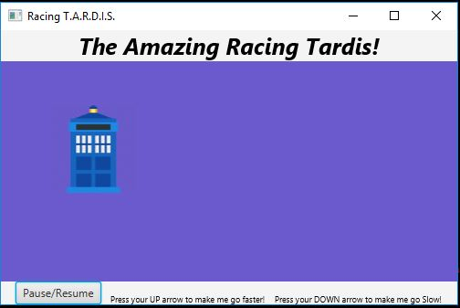

# Ex 15.29 Racing Car

Created a racing image. The T.A.R.D.I.S. will move from left to right. When it hits the end of its path it will restart from the beginning. This project also utilizes a button which will pause/resume the race. Along with, functions that speed up and slow down the tardis using the up and down arrow.

## Example Output

## Analysis Steps

First off, I notice that the movement for my TARDIS was very similar to the example given in the book of the moving flag. I utilized some of the code for that example after editing the path that my object would take. Instead of a regular pane I used a stack pane to organize all of my elements. I created the button which would pause and resume the object and the path that it was on. I used the pause() and play() methods with in the the Lambda Expressions that control the button's function.
To control the keystrokes and their methods I did a similar Lambda expression along with an if / if else statement to determine what it would do when pressed. To control the speed of the object when the keystroke was activated I took my PathTransition object and utilized setRate(). Finally, I added the text heading and text directions so the user knew that they could control the speed of the Tardis. I also added some inline skinning to the project to change the background of the Pane.
### Design

I set this project up like the typical JavaFX project. I didn't use any other classes than the default. I used the Lambda Expression instead of using methods outside of the class. This made my code easier to read and better functionality of the project.

### Testing

I got my image on the scene and moving using the example from the book. 

Then I realized that a stackPane with HBoxs would work better for laying out the project beings I was working with multiple objects.

I changed everything and tested to see if everything still worked

Next, I started on my buttons. I originally started off with 3 buttons one to play, pause, and stop. They worked great! After re-reading the instructions I combined the pause and play functions into one button and deleted the extra buttons.

Everything was working great so I moved on to the speed section of this assignment. It took me a little while to figure out how to call these keys even with the books instruction. The problem was getting the functions not throw out an error. I finally figured out how to get it called properly using an if / if else statement. Ran the program and it worked great!

Next, I wanted to add some directions for the user so they would know that they could use to control the speed. I had a little trouble getting everything to fit where it was readable at the bottom.

Finally, I messed around with the aesthetics of the GUI Added a header and played with the background and the style of the fonts. I'm enjoying the in-line styling techniques it's fun to play with. 

## Notes

Project probably took me about 5 hours to complete. 